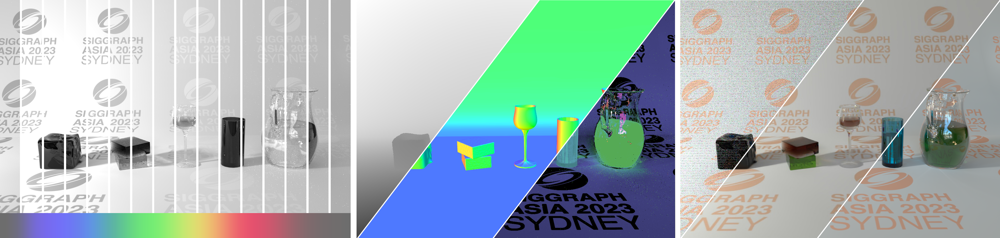

# Spectral Monte Carlo Image Denoising
This is the code release attached to the paper [Spectral Monte Carlo Image Denoising](https://hal.univ-reims.fr/) submitted to Visual Computer.



## Overview

This repository provides our denoiser application  into the Mitsuba 3 renderer (https://github.com/mitsuba-renderer/mitsuba3):

**Notes**: Supplied code and data have been tested and validated on Linux (Ubuntu, Debian, Manjaro) and Windows.

## Step by Step installation

### Prerequisities

**Mandatory**

- Git command line client: https://git-scm.com/

- A package managment system. This tutorial was defined with apt-get.

**Recommended** :

- Visual Studio Code with Dev Container extension provided by Microsoft

- Docker 24.0.0 : https://www.docker.com/

- A spectral image viewer (for example : [Tev](https://github.com/Tom94/tev) or [XnView](https://www.xnview.com/fr/))

- One or multiple Nvidia GPU(s) with a CUDA version equal or greater than 11.7

### Retrieving the code

Download Mitsuba3 (current supported version : 3.3.0)

```
git clone -b v3.3.0 --single-branch https://github.com/mitsuba-renderer/mitsuba3.git mitsuba3
```

Download the paper's add-on

```
git clone https://romeogit.univ-reims.fr/athebault/luce-custom_mitsuba3.git
```

Jump into the second git

```
cd luce-custom_mitsuba3
```

Launch the upgrade script. It copies all the required files to the Mitsuba base. If you moved Mitsuba's folder or renamed it, please add its new location when calling the script.

```
sh upgrade_mitsuba.sh [-optional : Mitsuba's directory]
```

### Preparation : With the docker container

A docker container is available with the project in .devcontainer. Visual Studio Code was mainly used to manage the instances and is recommended. If not used, the runtime must be manually defined to nvidia (and Docker linked to nvidia-docker). 

Additionnaly, if Docker doesn't properly detect Optix libraries, you may want to link the .so inside usr/lib/x86_64-linux-gnu. Mitsuba will be built but won't launch in GPU mode as Optix is used to optimize GPU kernels.

### Preparation : Without the docker container

Building Mitsuba requires llvm, cmake, ninja and python. 

```
sudo apt update
sudo apt install -y clang libc++-dev libc++abi-dev cmake ninja-build
sudo apt install -y libpng-dev libjpeg-dev
sudo apt install -y libpython3-dev python3-distutils
```

The clang version matches the one from the docker container. You may want to adapt the exact tag depending on your environment (Ubuntu 22.04 vs 20.04 for example).

```
pip install clang==14.0.0
pip install libclang==14.0.1
sudo apt-get install -y clang-format clang-tidy clang-tools clang clangd libc++-dev libc++1 libc++abi-dev libc++abi1 libclang-dev libclang1 liblldb-dev libllvm-ocaml-dev libomp-dev libomp5 lld lldb llvm-dev llvm-runtime llvm python3-clang 
```

Finally, the python-CPP hybridation requires pybind and the generation of docstrings to work. This step is optional as the updated documentation is packaged directly with the add-on. However, if functions were to be added or altered, ```ninja docstrings``` would become mandatory.

```
pip install pybind11
pip install pybind11_mkdoc
sudo apt install -y mkdocs
pip install mkdocs
```

### Building

All the requirements are met, you can now start to build Mitsuba.

```
mkdir build
cd build
cmake -GNinja ..
```

Mitsuba will check the environment and create a file named "mitsuba.conf". You must specify specific variants for the build, especially "cuda_spectral" (first list of the file after the comments). "ad" "differentials" variants can be removed to reduce building time. A complete guide is available in the same file.

```
# Modify Mitsuba.conf file, line 86-88 to have :    
   "enabled": [
        "scalar_rgb", "scalar_spectral", "cuda_spectral"
    ],
```

Once Mitsuba.conf modified, you can build the solution with Ninja.

```
ninja
```

To spread the updated python plugin globally and use mitsuba as a command line executable :

```
source setpath.sh
```

### Running Mitsuba (without the denoiser)

This step is a first check to verify that everything was installed correctly. It simply requires to load the first part of the demo notebook or to launch mitsuba via command-line. The output will be a slightly altered scene with custom dielectrics.

Commands :

- ```jupyter notebook``` and then launch "demo.ipynb" from the folder "notebooks". You might want to add ```--allow-root``` and ```--notebook-dir=```

or

- ```mitsuba -m cuda_spectral scenes/CB_nodenoiser.xml -o demo.exr```

ImageMagick doesn't fully support OpenEXR. Trying to convert the EXR file into a PNG or a JPEG may result in anomalies and reduced visual data. We highly recommend Tev to view the channels.

### Running Mitsuba (with the denoiser)

The base Denoiser from Mitsuba is extended through the pybind11 implementation. You can either continue running the demo notebook or run the example script.

Commands :

- ```jupyter notebook``` and then launch "demo.ipynb" from the folder "notebooks". You might want to add ```--allow-root``` and ```--notebook-dir=```

or

- ```sh mitsuba_demo.sh```

## Citation

If you use this code, please consider citing our work accordingly: 

```
@article{Mathieu2026,
  author    = {Noizet Mathieu and Robin Rouphael and Herv{\'e} Deleau and St{\'e}phanie Pr{\'e}vost and Luiz-Angelo Steffenel and Laurent Lucas},
  title     = {Spectral Monte Carlo Denoising},
  journal   = {The Visual Computer},
  year      = {2026},
  volume    = {42},
  number    = {4},
  pages     = {181},
  doi       = {10.1007/s00371-026-04374-5},
  url       = {https://doi.org/10.1007/s00371-026-04374-5},
  issn      = {1432-2315}
}
```

## Results

The results can be viewed directly on an online application, available at the following address: http://35.226.203.18/

## Acknowledgements

This work is part of the research program **LUCE** (project number ANR-21-CE33-0010), which is funded by the French national agency for scientific research (ANR). We thank the ROMEO computing center and the Image Center at URCA for their material contributions in high-performance computing and visualization resources.

## Contact

Feel free to send an e-mail to `mathieu.noizet[at]univ-reims.fr` or `laurent.lucas[at]univ-reims.fr` if you have any question.
